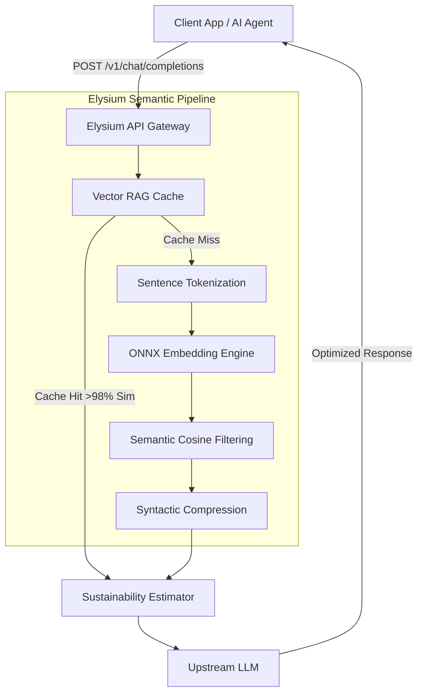

# Elysium (Green AI Middleware)

Elysium is an API middleware designed to sit between your application and Large Language Models (LLMs) like GPT-4 or Claude 3. It mathematically optimizes and compresses prompts using an on-device Machine Learning pipeline (ONNX) before sending them to external providers. 

This directly reduces GPU utilization, latency, and estimated carbon emissions without compromising semantic intent.

---

## The Problem Statement

**The "Jevons Paradox" of AI:**
Modern AI applications (especially RAG pipelines and Autonomous Agents) send thousands of redundant, repetitive, and bloated tokens per request. 
When these bloated prompts reach data centers, they run through extremely power-hungry GPU clusters (like NVIDIA H100s). Processing unnecessary tokens wastes immense amounts of electricity, increases API bills, and drives up planetary carbon emissions.

## The Solution

**Edge-to-Cloud Triage:**
Elysium intercepts the prompt and performs a "triage" operation using a microscopic, highly quantized AI model (`all-MiniLM-L6-v2-ONNX`). By spending a tiny fraction of a watt locally on a standard CPU, Elysium intelligently drops redundant sentences and conversational filler before the prompt ever reaches the cloud. 
This prevents the massive remote GPU clusters from having to spend dozens of watts computing wasted tokens.

---

## Architecture

Elysium is built entirely on a lightweight Python (FastAPI) and Rust (Tokenizers/ONNX) foundation.



### Why this Architecture is State-of-the-Art

1. **True Semantic Filtering (ONNX)**: Instead of using fragile regex rules or keyword counting, Elysium generates 384-dimensional dense vectors for both the overall prompt and individual sentences. It computes the dot-product (cosine similarity) to scientifically drop sentences that do not align with the core mathematical intent.
2. **Zero-Dependency Vector RAG Caching**: Most caching layers require heavy external databases like Redis or ChromaDB. Elysium implements a high-speed Nearest Neighbor search using raw `Numpy` over an embedded `SQLite` BLOB store. If a new prompt is >98% semantically identical to a cached prompt, it skips the optimization pipeline entirely.
3. **Zero PyTorch Bloat**: To remain deployable on strictly constrained free-tier environments (512MB RAM), Elysium strips out PyTorch entirely. It relies strictly on `onnxruntime` and HuggingFace's Rust-based `tokenizers`. The model footprint is barely ~22MB and runs on standard CPUs in < 25ms.

---

## Optimization Modes

Clients can inject a specific mode directly into their OpenAI client headers (`X-Elysium-Mode`) to configure the aggressive nature of the compression:

- **`eco-max`**: Aggressive pruning. Achieves maximum token savings and carbon reduction.
- **`optimal`** *(Default)*: The perfect mathematical balance between safety thresholds and token reduction.
- **`precision`**: High-fidelity contextual retention for complex coding/math tasks.

---

## Agent Integration

Elysium is a drop-in replacement for any framework (LangChain, AutoGen, LlamaIndex). Simply swap your `base_url` to route through Elysium:

```python
from langchain_openai import ChatOpenAI

llm = ChatOpenAI(
    api_key="YOUR_OPENAI_KEY",
    base_url="https://api.elysium.tech/v1",
    model="gpt-4o-mini",
    default_headers={"X-Elysium-Mode": "optimal"}
)

response = llm.invoke("Optimize my agent workflow.")
```

---

## Mathematical Impact Models

Elysium uses transparent, auditable math to estimate the environmental impact of prompt optimization. It calculates metrics in real-time for every request:

### 1. Token Delta
The absolute reduction in transformer compute requirements:
```text
Tokens Saved = Tokens Before - Tokens After
```

### 2. Energy Avoided (kWh)
Estimates the reduction in electricity required by the data center's GPU cluster (default assumes 0.0005 kWh per 1k tokens on frontier models):
```text
Energy Saved = (Tokens Saved / 1000) × 0.0005
```

### 3. Carbon Emissions Prevented (g CO₂)
Calculates the carbon mass prevented based on the average grid carbon intensity (default assumes 400g CO₂ per kWh):
```text
CO₂ Avoided = Energy Saved × 400
```

These metrics are actively returned in the API payload, allowing engineering teams to build verifiable ESG (Environmental, Social, and Governance) reports based on their software's RAG pipeline efficiency.

---


## Future Research Potential

This project serves as a foundational prototype for **"Compute-Aware AI Routing"**. Future iterations could use this exact architecture to not just compress prompts, but to dynamically route requests between smaller local models and larger frontier models based on real-time grid carbon intensity.
